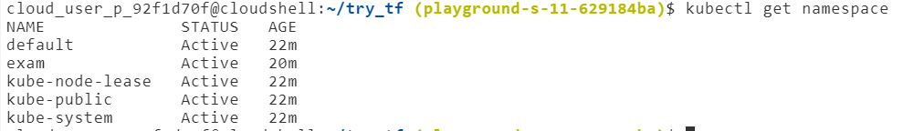
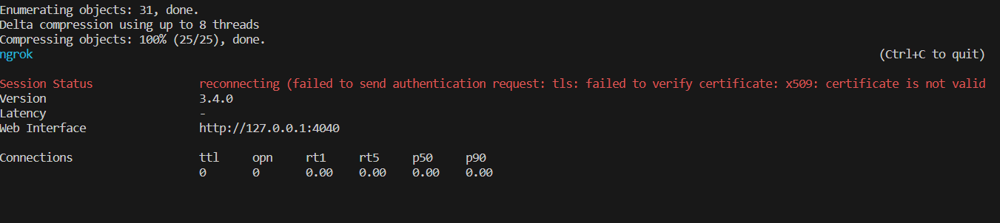

# DevOps_Rachel_Exam

#Part-1

#### .1 I copied the server.js and wrote the Dockerfile:

```
# Use an official Node.js runtime as a parent image
FROM node:14

# Set the working directory in the container
WORKDIR /usr/src/app

# Copy package.json and package-lock.json to the container
COPY package*.json ./

# Install app dependencies
RUN npm install

# Create a 'src' directory and copy the server.js file
RUN mkdir src
COPY src/server.js src/

# Expose the port on which the app will run
EXPOSE 8080

# Define the command to run your app
CMD ["node", "src/server.js"]
```

Details of the commands:

+ FROM node:14: Specifies the base image as Node.js version 14 from the official Docker Hub repository.

+ WORKDIR /usr/src/app: Sets the working directory within the container to /usr/src/app.

+ COPY package.json ./:* Copies the package.json and package-lock.json files from the local directory to the container's working directory.

+ RUN npm install: Installs the Node.js application dependencies based on the package.json and package-lock.json files.

+ RUN mkdir src: Creates a 'src' directory within the container.

+ COPY src/server.js src/: Copies the server.js file from the local 'src' directory to the 'src' directory within the container.

+ EXPOSE 8080: Informs Docker that the application will use port 8080.

+ CMD ["node", "src/server.js"]: Specifies the command to run when the container starts. In this case, it runs the server.js file using the Node.js runtime.

#### .2 Now I built the image with the command:

```
docker build -t server:v1.0 .
```
(My Dockerhub username is rubberrachel)

```
PS C:\Users\rachel.cohen4\Documents\some\cd_proj> docker images
>>
REPOSITORY   TAG       IMAGE ID       CREATED         SIZE
server       v1.0      c4bce217802e   9 minutes ago   912MB
```

#### .3 I then ran:

`
docker tag server server:1.0 
`

and then:

`
docker run -p 8080:8080 -d server:1.0
`

for running the container.


## Patr - 2

#### 1. I created a cluster in a bash script

#### 2. You can see the attached terraform files
#### 3. I did all these requirements in the bash script



## Part 3
I got this:



and this is my config file

```
version: 2
tunnels:
    your_tunnel_name:
        proto: http
        addr: 8080
authtoken: 2YGM982dN4Oe4XX8hVqcQ9RcFEA_7EpFGzgJeMaS64UbKXAbm
```
I checked why that is. And that's because of the antivirus I have on my computer

## Bonus questions
* Docker
bash:
```
export DOCKER_CLI_EXPERIMENTAL=enabled
docker build --platform darwin -t your_image_name:tag .
```
* Terraform
#### 2. I did
#### 3.
- Navigated to the directory where your Terraform configuration files were located- to setup
- Then Ran the following command:
`
terraform console
`
- Once the console was open, you could test and debug your local variables or module outputs
(for example module.kubernetes.taxes_namespace)
- If I want to see the values of local variables or outputs during a terraform apply, I could use the -var flag to set variable values and then observe the output

* K8S

I have to install MetalLB in my Kubernetes cluster

```
apiVersion: v1
kind: Namespace
metadata:
  name: metallb-system

---
apiVersion: v1
kind: ServiceAccount
metadata:
  namespace: metallb-system
  name: controller

---
apiVersion: rbac.authorization.k8s.io/v1
kind: ClusterRole
metadata:
  name: metallb-system:controller
rules:
- apiGroups: [""]
  resources: ["services"]
  verbs: ["get", "list", "watch"]
- apiGroups: [""]
  resources: ["pods"]
  verbs: ["get", "list", "watch"]

---
apiVersion: rbac.authorization.k8s.io/v1
kind: ClusterRoleBinding
metadata:
  name: metallb-system:controller
roleRef:
  apiGroup: rbac.authorization.k8s.io
  kind: ClusterRole
  name: metallb-system:controller
subjects:
- kind: ServiceAccount
  name: controller
  namespace: metallb-system

---
apiVersion: v1
kind: ConfigMap
metadata:
  namespace: metallb-system
  name: config
data:
  config: |
    address-pools:
    - name: default
      protocol: layer2
      addresses:
      - 192.168.1.240-192.168.1.250

```
Then run:
`
kubectl apply -f metallb.yaml
`

I then updated the Terraform Kubernetes configuration to expose the Nginx service with the LoadBalancer type. I changed the main.tf file accordingly:

```
...
  port {
      port        = var.service_ports[0]
      target_port = var.service_ports[0]
    }

    type = "LoadBalancer"
  }
  ...
```


## Thank you
### I enjoyed the exam
### Have a pleasant exam check