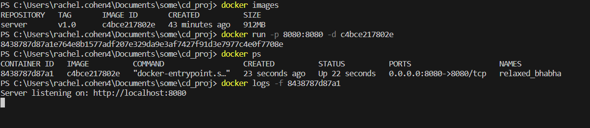

# DevOps_Rachel_Exam

#Part-1

#### .1 I copied the server.js and wrote the Dockerfile:

```
# Use an official Node.js runtime as a parent image
FROM node:14

# Set the working directory in the container
WORKDIR /usr/src/app

# Copy package.json and package-lock.json to the container
COPY package*.json ./

# Install app dependencies
RUN npm install

# Create a 'src' directory and copy the server.js file
RUN mkdir src
COPY src/server.js src/

# Expose the port on which the app will run
EXPOSE 8080

# Define the command to run your app
CMD ["node", "src/server.js"]
```

Details of the commands:

+ FROM node:14: Specifies the base image as Node.js version 14 from the official Docker Hub repository.

+ WORKDIR /usr/src/app: Sets the working directory within the container to /usr/src/app.

+ COPY package.json ./:* Copies the package.json and package-lock.json files from the local directory to the container's working directory.

+ RUN npm install: Installs the Node.js application dependencies based on the package.json and package-lock.json files.

+ RUN mkdir src: Creates a 'src' directory within the container.

+ COPY src/server.js src/: Copies the server.js file from the local 'src' directory to the 'src' directory within the container.

+ EXPOSE 8080: Informs Docker that the application will use port 8080.

+ CMD ["node", "src/server.js"]: Specifies the command to run when the container starts. In this case, it runs the server.js file using the Node.js runtime.

#### .2 Now I built the image with the command:

```
docker build -t server:v1.0 .
```
(My Dockerhub username is rubberrachel)

```
PS C:\Users\rachel.cohen4\Documents\some\cd_proj> docker images
>>
REPOSITORY   TAG       IMAGE ID       CREATED         SIZE
server       v1.0      c4bce217802e   9 minutes ago   912MB
```

#### .3 Then I ran:

`
docker tag server server:1.0 
`

and then:

`
docker run -p 8080:8080 -d server:1.0
`

for running the container.


